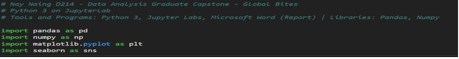
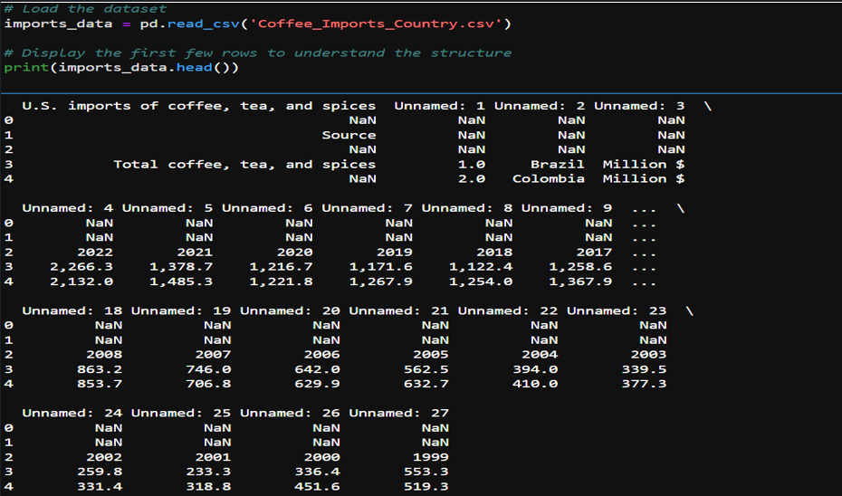
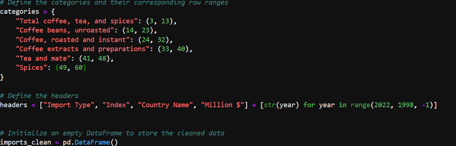
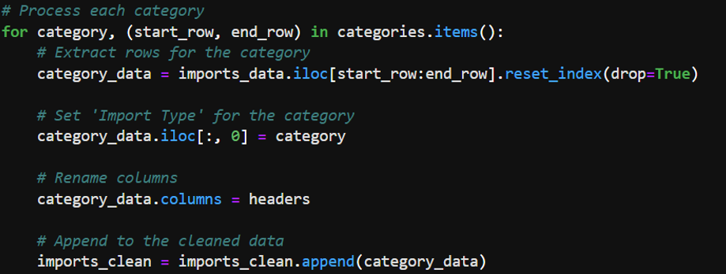
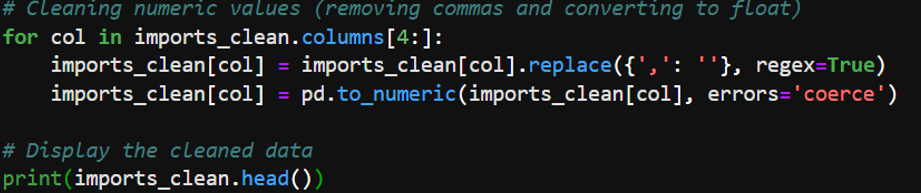
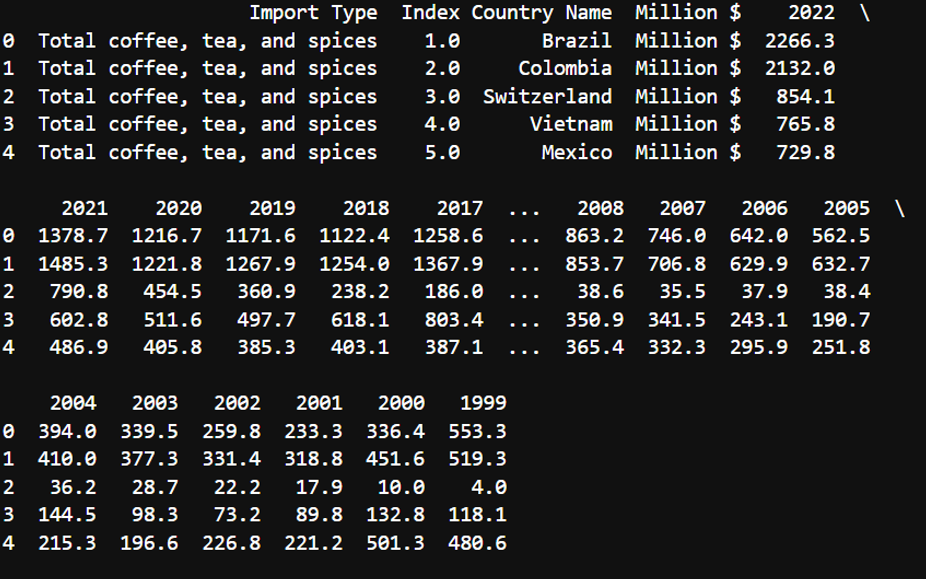
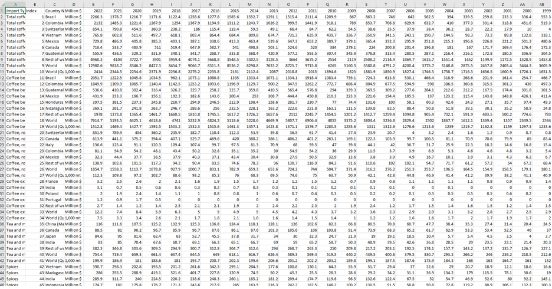
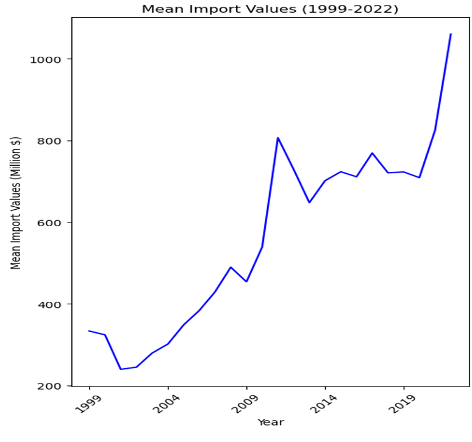
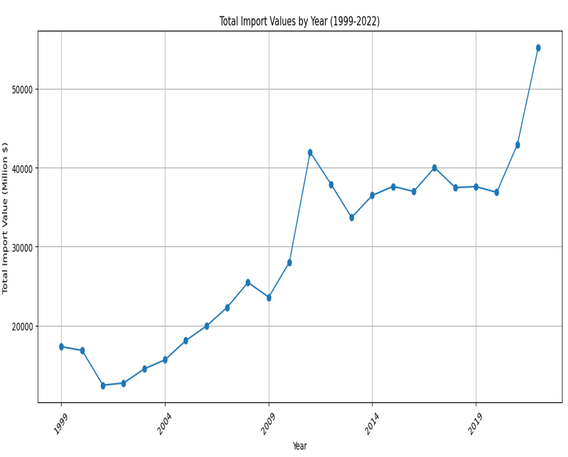
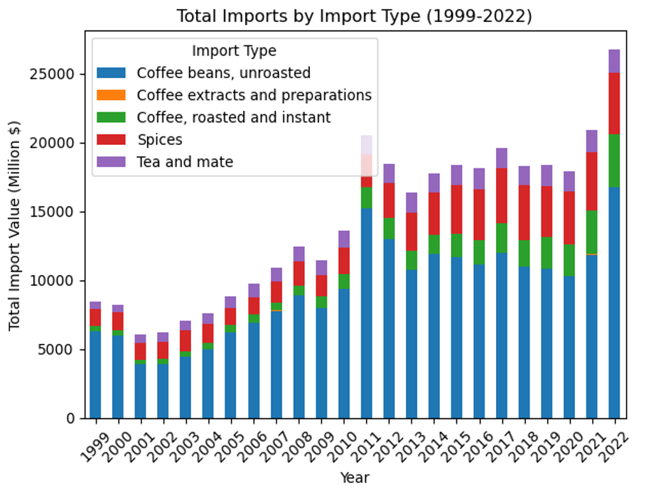

# D214 - Data Analytics Graduate Capstone
The Data Analytics Graduate Capstone allows students to apply the academic and professional abilities developed as a graduate student. This capstone challenges students to integrate skills and knowledge from several program domains into one project. Advanced Data Analytics is a prerequisite for this course.

## Course Analysis
This course is structured around three main tasks:

### Task 1: Capstone Approval and Release Form
The majority of time for this task was revolved around finding a suitable topic for analysis that would be challenging and interesting, while also having a real world use case. I spent maybe several hours alone just looking into various datasets, mostly on Kaggle, downloading several and conducting EDA to attempt to find a dataset that I would like to work with for the entirety of the course. In the end I decided to settle on U.S. Food Imports Data sourced from United States Department of Agriculture. The dataset can be found here [U.S. Food Imports](https://catalog.data.gov/dataset/u-s-food-imports).

### Task 2: Data Analytics Report and Executive Suummary
For Task 2, we will define the Research Question and Hypothesis to test for the analysis of the US Foods Imports Data. In this task the following analysis steps will be performed: Data Collection, Data Extraction/Preparation and Exploratory Data Analysis.
#### Research Question and Hypothesis
Research Question: To what extent can the future import values of specific food commodities such as coffee, teas, and spices into the United States be predicted using time series forecasting models?

Hypothesis
* Null Hypothesis (H0): The import values of coffee, tea, and spices into the United States for the upcoming year cannot be predicted with an accuracy of 90% using the Mean Absolute Percentage Error (MAPE) as a metric for model performance."
* Alternative Hypothesis (H1): The import values of coffee, tea, and spices into the United States for the upcoming year can be predicted with an accuracy of 90% or more using the Mean Absolute Percentage Error (MAPE) as a metric for model performance.
  
#### Data Collection
For this project I titled "Brewing Trends”, I obtained a comprehensive dataset from the United States Department of Agriculture (USDA). This dataset details the import values of various food commodities, including coffee, into the United States over the past 20 years. The data, structured annually, provides insights into the volume and value of food imports and includes key variables such as types of food commodities, year of import, the value of these imports in millions. The primary method of data collection was searching the internet for reliable sources of data such as government data. For this project, I used a dataset provided by the USDA, which can be found on their official website, as well as data.gov.

#### Data Extraction/Preparation
Objective of this step will be to extract and prepare the data for use in a time series analysis. Tools and Techniques used is as follows:
##### Python (Anaconda Environment):
*	Usage: Served as the primary programming language for data manipulation and analysis.
*	Advantage: Python offers extensive libraries and frameworks that simplify data analysis and model development. Examples include pandas, numpy, matplotlib, and sklearn.
*	Disadvantage: Python can be less efficient in terms of execution speed compared to lower-level languages like C++.
##### Jupyter Notebook (Anaconda Environment):
*	Usage: Jupyter Notebook provided an interactive environment for executing Python code, enabling real-time data manipulation and visualization.
*	Advantage: It allows for an interactive coding environment with the ability to visualize data and outputs immediately.
*	Disadvantage: Handling very large datasets in Jupyter Notebook can be cumbersome and may lead to performance issues.
##### Libraries Used:
*	Pandas: Utilized for data cleaning, manipulation, and analysis. It was instrumental in reformatting the original dataset into a more analyzable format.
*	NumPy: Will be used for numerical computations, especially useful in manipulating arrays and performing mathematical operations.
* Matplotlib: Intended for visualizing data, important for understanding data trends and patterns essential for time series forecasting.
* Scikit-learn (Sklearn): To be used for implementing machine learning models, particularly time series forecasting models.

##### Data Cleaning

* The dataset initially contained irrelevant and misplaced rows and columns.
* Specific rows were identified and selected based on the category they represented (e.g., "Total coffee, tea, and spices").
* Numeric values were cleaned by removing commas and converting strings to numeric data types.
* Initial imports
  
* Load Dataset into Data frame
  
* Defining Categories and Headers
  
* Processing Categories and Appending New Data
  
* Cleaning Numeric Values
  
  
* Cleaning Before and After
  
  

#### Exploratory Data Analysis
##### Mean Import Data 
*	Overall Trend: There is a clear upward trend in the mean import values over the observed period. This suggests an increase in the average value of imports entering the U.S. over time for the commodities being analyzed.
*	Periodic Fluctuations: Despite the overall upward trend, there are periods of fluctuation where mean values dip and rise. Notably, there are dips around the early 2000s, mid-2000s, and early 2010s.
*	Notable Dips: After a pronounced dip around 2008, which could be attributed to the global financial crisis, there is a significant growth in mean import values peaking around 2011 before another dip.
*	Economic Indicators: The exact reasons for the fluctuations and growth could be numerous, including changes in global market demand, price changes of commodities, trade policies, and economic conditions.

##### Total Imports
*	Overall Trend: The chart shows a general upward trend in total import values over the given time period, indicating an increase in the value of imports.
*	Periodic Fluctuations: There are noticeable year-to-year variations in import values, with certain years experiencing significant increases or decreases compared to adjacent years.
*	Notable Dips: There are notable dips in the graph, particularly after the years 2000 and 2008, which may correspond to economic downturns, such as the dot-com bubble burst and the global financial crisis.
*	Economic Indicators: This upward trajectory, particularly in the latter years, could be influenced by a variety of factors, such as increased demand, inflation, changes in trade policies, or other economic conditions.

##### Imports by Import Types
*	Overall Trend: The chart generally indicates a rising trend in total import values over the years. This suggests an increase in the U.S. demand for these commodities or a rise in their prices, or both.
*	Import Variability: There is variability in the proportional contribution of each category to the total imports. Some categories, such as unroasted coffee beans, show a consistent presence over the years, while others fluctuate more noticeably.
*	Notable Increases: There is a pronounced increase in the total import values in the final year, 2022, which is significantly higher than any other year. This could be due to a variety of factors, including market dynamics, changes in trade policies, or economic inflation.
*	Economic Indicators: While the overall trend is upward, there are fluctuations from year to year. Some years show a decrease or plateau in total imports, indicating potential economic cycles or changes in industry patterns.

### Task 3: Executive Summary and Implications
The executive summary for this project can be found here: [Executive Summary](https://github.com/nay244/D214/blob/main/NaingNay_D214_T3.pdf).

