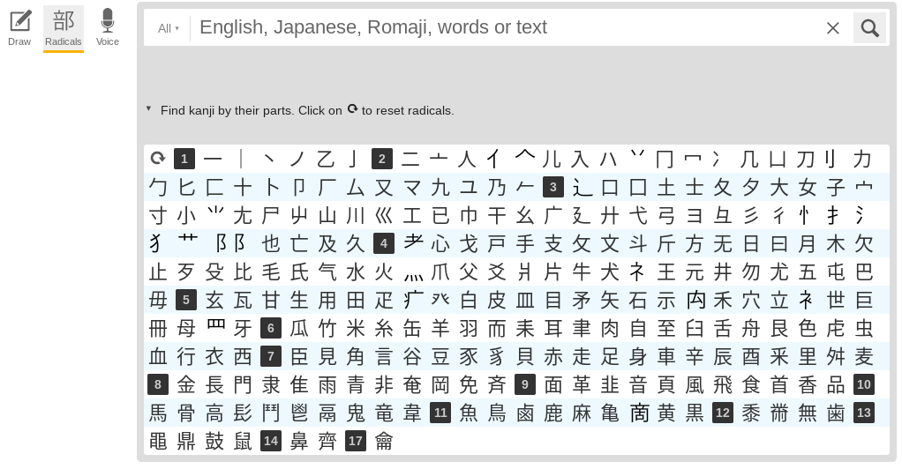
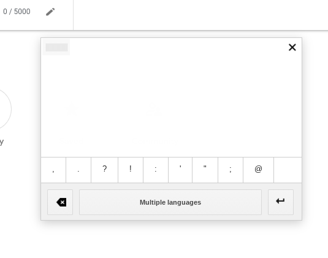

# How do I look up the meaning of this kanji?

 - Go to [Jisho](https://jisho.org) (or use the [mobile app](https://play.google.com/store/apps/details?id=ric.Jsho))
 - Hit the search by radical button to bring up the radicals menu:
  
 - Compose the kanji with the various radicals until it appears in one of the
   listed options.

Alternatively, if you cannot find the kanji on jisho:

 - Go to [Google Translate](https://translate.google.com/)
 - Use the handwriting tool to scribble something that looks similar to the
   kanji you want, and look at the results. Google Translate is quite smart and
   does not care much about accuracy or stroke order.
  

