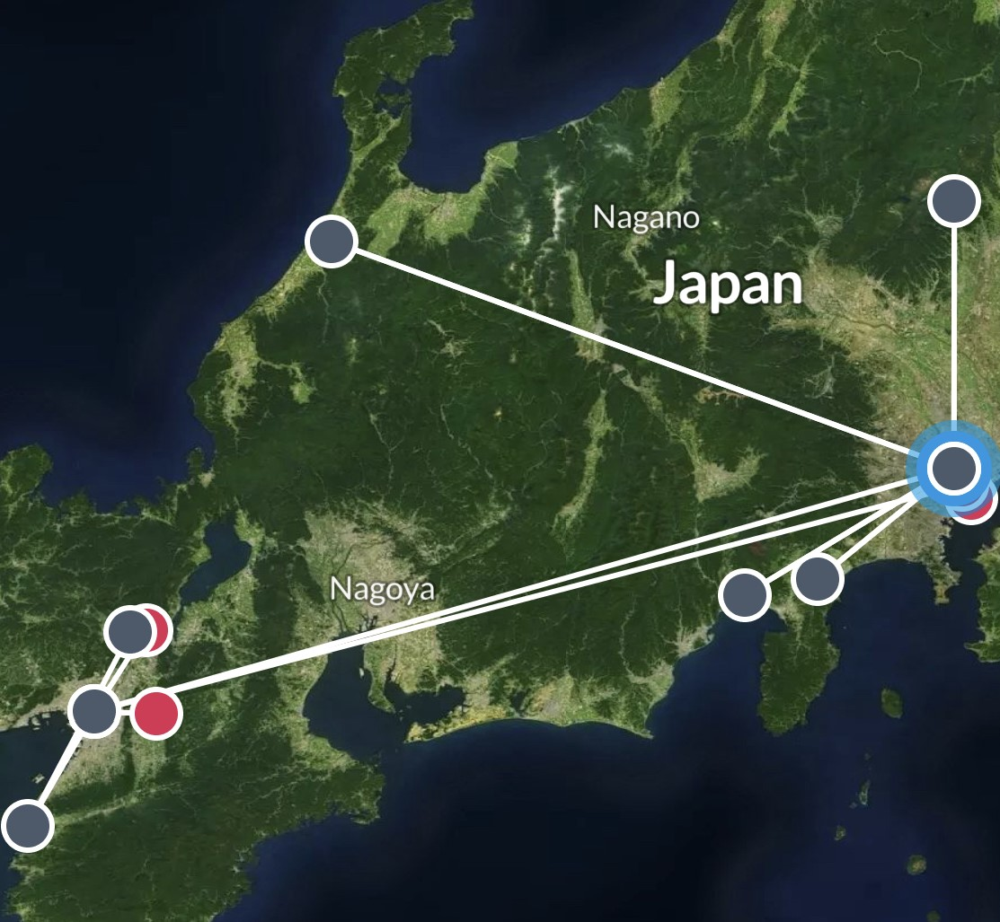
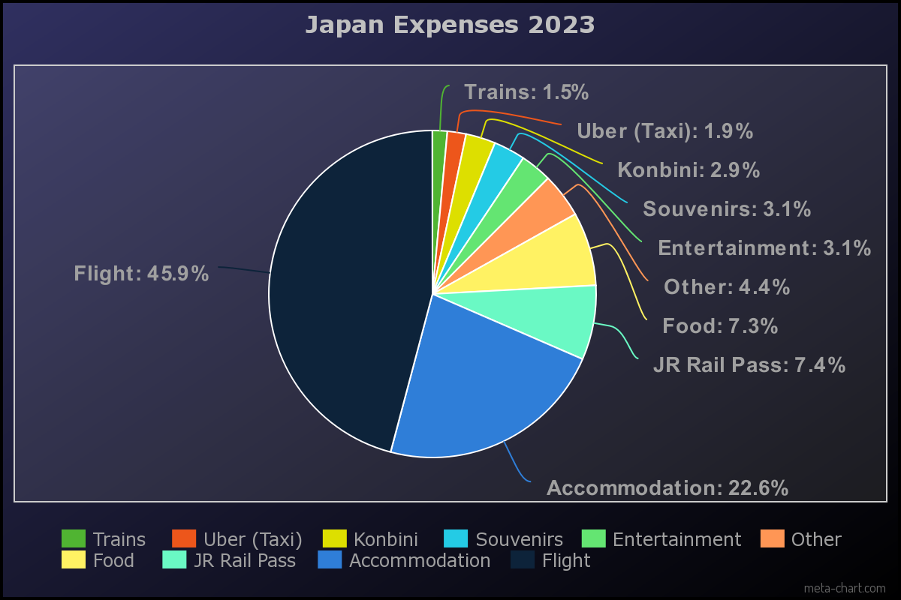

# Japan 2023
From over 2 years since the initial discussion to the months of planning and discussing our trip to Japan, a journey that started as a shared dream among a few close friends, finally became a reality. 
This trip was more than just a brief break from our lives in the States; it was the culmination of countless hours spent discussing activities of interest, and excited chats about all the places to explore. 
As the months passed, our adventure grew in an unexpected but welcome way – friends we had known only online were now joining us, turning our group into a unique blend of old and new friendships. 
Meeting these friends in person for the first time, in a country most of us had never been to before, added an indescribable excitement to our already anticipated journey.

However, thats not to say that Japan as a country is a great place to live. While there and interacting with the locals and just observing daily life, I realized that being a tourist there was something far different than actually living there. On the surface, Japan appears to be a highly advanced, technologically advanced, low-crime and culturally rich society, but it's a society that seems to be completely dominated by group identity. Everything is about the group, nothing is about ones self. Also, Japan's work culture is accompanied by its uown nique set of challenges, such as the grueling work hours, fierce competition for jobs, limited opportunities for career advancement, and noticeable gender disparities. These aspects create a multifaceted impact on Japanese society as a whole, affecting the well-being of its people. So, while as a foreigner it was an amazing experience, I can't really see myself wanting to live here for long periods of time unless the situation changes. 

## Travel Log

**Tokyo (Day 1: 10/22)**  
Arrive at Haneda Airport  
Due to unfortunate delays and circumstances get stuck at airport till next day.

**Osaka (Day 2: 10/23)**  
Early morning departure with shinkansen from Haneda Airport to Osaka station  
Settle into Osaka Airbnb late afternoon.  
Explore the nearby Shinsaibashi Shopping Street

**Nara (Day 3: 10/24)** 
Nara Park 
Stroll through Dotonbori

**Osaka (Day 4: 10/25)**
Explore the nearby Tempozan Ferris Wheel and take in the views of Osaka Bay 
Visit the Osaka Aquarium

**Kyoto (Day 5: 10/26)** 
Shinkansen to Kyoto for Fushimi Inari Taisha shrines 
Higashiyama district 
Kiyomizudera temple

**Kyoto (Day 6: 10/27)** 
Shinkansen to Kyoto for Arashiyama Bamboo Forest 
Arashiyama Monkey Park

**Tokyo (Day 7: 10/28)** 
Early morning Shinkansen ride from Osaka station to Shinagawa station(Tokyo)  
Stroll through Kabukicho

**Kanazawa (Day 8: 10/29)** 
Head to Shibuya Crossing 
Visit Hachiko statue 
Spend nighttime bar hopping in Shibuya

**Tokyo (Day 9: 10/30)** 
Start day with a visit to Asakusa 
Explore Nakamise Shopping Street 
Halloween Costume shopping

**Nikko (Day 10: 10/31)** 
Walk around Shibuya early afternoon 
Halloween in Shinjuku 
Clubbing in Shibuya

**Tokyo (Day 11: 11/01)** 
Nakano broadway 
Akihabara 
Visit the arcades and play some crane games 
Shinjuku

**Tokyo (Day 12: 11/02)** 
Explore Ikebukuro Sunshine City for cosplay event  
Visit Harajuku and Takeshita street

**Hakone (Day 13: 11/03)** 
Take a day trip to Nikko 
Visit Toshogu Shrine, Kegon Falls, and Lake Chuzenji

**Tokyo (Day 14: 11/04)** 
Visit Tsukiji fish market 
Explore teamLabs Planet museum 
Souveneir gift shopping

**Tokyo (Day 15: 11/05)** 
Early morning departure to Haneda airport from Tokyo Airbnb 
Last minute gift shopping at Don Quijote in Roppongi.

---

---
## Expenses 

  * Total Spent: ~ $2,750 USD
  * Konbinis Visited: 31
  * Yen Spent(Konbini): 12,122
  * Vending Machines Used: 8
  * Yen Spent(VM): 1,212
  * Biggest Expense (Flight): 1,250 
  * Transportation: ~ $290.80 USD
  * Avg. Spent per Day: ~ $68 USD

---

---

