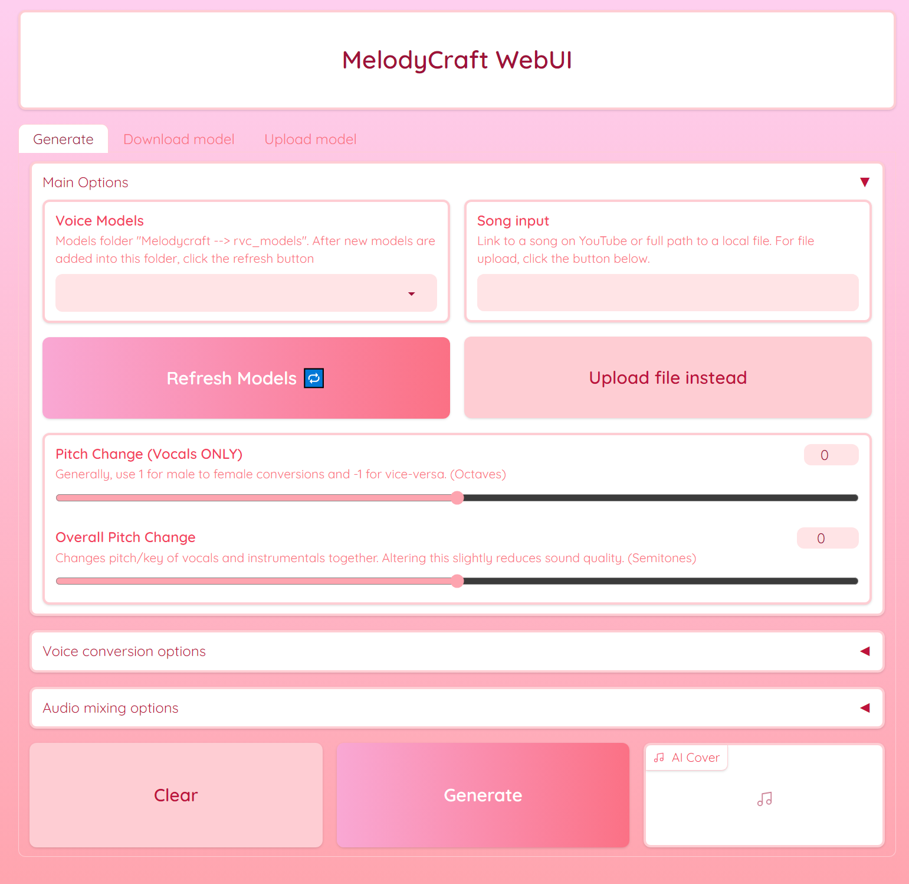

# MelodyCraft AI

Autonomous pipeline to create song covers or voice-overs of any Youtube video using RVC v2 trained AI voices.

## The Autonomous Pipeline
The autonomous pipeline of the AICoverGen application is primarily orchestrated through the main.py script. This script integrates various components and functionalities to successfully run the application. Here's an overview of how the scripts work in conjunction:

1. YouTube Video Processing and Downloading:
   1. The get_youtube_video_id function in main.py extracts the video ID from a YouTube URL.
   2. TThe yt_download function then downloads the audio from the YouTube video.
2. Audio Processing:
   1. The preprocess_song function in main.py handles the preprocessing of the song. This includes downloading the song, converting it to stereo, and then seperating the vocals from the instrumentals using the MDX-Net model.
3. Vocal Conversion:
   1. The voice_change function in main.py is used for converting the voice in the audio, utilizing the RVC model.
4. Audio Effects and Mixing:
   1. The add_audio_effects function applies audio effects like reverb and compression.
   2. The combine_audio function then combines the AI vocals with the instrumental and backup vocals to produce the final audio output.
    
## Scripts and Functions
General breakdown of each python script involved in the program purpose.

* main.py: This script will handle the overall workflow. It will call functions from other scripts based on the input it receives (like a YouTube URL or a local audio file). 
  
* downloads_models.py: This script is designed to download specific machine learning models required by the AICoverGen application. It targets two types of models: MDX (Music Demixing) models and RVC (Robust Voice Conversion) models. 
  
* mdx.py: This script defines the core functionality for audio processing. It includes classes and methods for handling audio data, such as loading and processing audio files, performing Short-Time Fourier Transform (STFT) and its inverse, and managing the audio separation model.  
  
* rmvpe.py: This script is focused on implementing the vocal pitch estimation model. It defines various classes and methods that are essential for the model's operation, including data preprocessing, neural network layers, and inference methods.  
  
* rvc.py: This script is responsible for configuring and executing a voice conversion process. It includes functions for loading models, setting up configurations, and running the voice conversion pipeline.  
  
* my_utils.py: This script contains utility functions that are used across the project. The functions contained include operations like audio processing, data manipulation, or other general-purpose tasks that support the main functionality of the application. 
  
* trainset_preprocess_pipeline_print.py: This script is designed for preprocessing audio data to prepare it for training machine learning models. It includes functions for slicing audio files, normalizing volume, and resampling. The script automates the process of converting large sets of audio data into a format suitable for training.  

* vc_infer_pipeline.py: This script is used for voice conversion, transforming the voice in an input audio file to sound like a different target voice using pre-trained models. It includes steps for audio processing, feature extraction, and the conversion process itself. The output is an audio file where the input voice has been modified to resemble the target voice.  

* webui.py: This script will provide a user interface for the AI song cover generation application. Utilizes Gradioto python library to create an interactive web interface. This interface allows users to input song from Youtube, select voice models, and adjust various parameters like pitch and reverb for the AI-generated cover song. The script also includes features for downloading and uploading voice models, as well as filtering and selecting models based on user preferences.  

## Application UI

