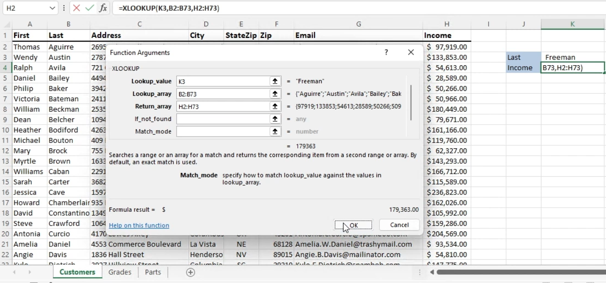
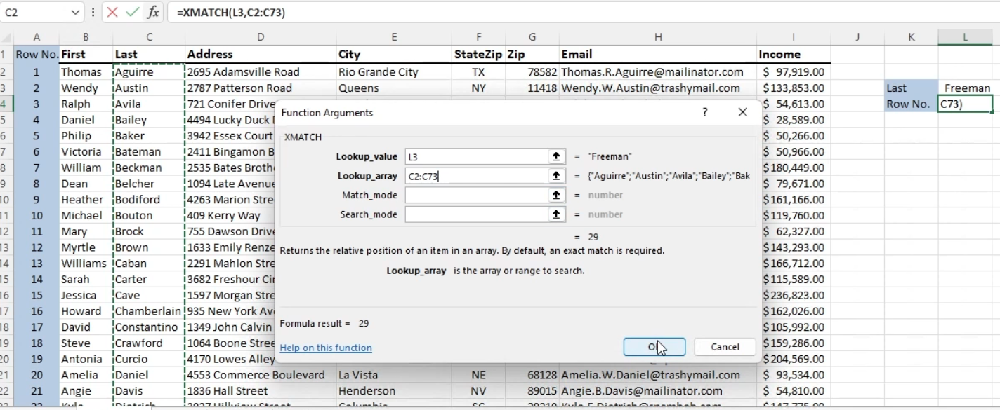

# Pluralsight Excel 365 Training
This section of the webpage will contains notes from the Pluralsight course on Excel 365, detailing key features and functionalities that are essential for mastering Excel in a professional setting.

## Formatting
Discusses the importance of cell formatting for readability and data interpretation. Key topics include number formatting, cell styles, and custom formats.

### Custom Number Formats
#### Use Cases
* Specific number formatting (Date, Time, Decimals, Accounting, Percentage, etc..)
* Data from csv file need to be formatted for analysis in 3rd party application (Leading Zeros).

### International Currency Formats
#### Symbols for Different Currency
Accounting Formats (Does not do conversion)

## Working with Data
Covers the basics of data entry, manipulation, and sorting. Emphasizes on efficient data management techniques.

### Outline Data
#### Group Data to Create Outlines
Data > Outline > Group/Ungroup

### Insert Subtotals
#### Get Subtotal Amount for a Specific Group
Data > Outline > Subtotal  
First sort list by criteria to subtotal by.

### Insert References
#### References Rows and Columns
* Relative reference example: =sum(C6:F6)
* Absolute reference example: =sum(G7*$F$3)  

### Reference Data by Using Structured References
#### Reference Data by Use of Table Names
* Count of fields in table Sales: =COUNT(Sales)
* Max Change of values in table Sales: =MAX(Sales[Change])  

### Consolidate Data
#### Consolidating Data From Multiple Workbooks
Data > Data Tools > Consolidate  

### Configure Data Validation
#### Limit User Inputs
Data > Data Tools > Data Validation  

### Analyze Data
#### Extract Information from Data
Home > Analysis > Analyze Data
* Create PivotTables, PivotCharts, Suggestions, etc..  

### Look Up Data by Using the XLOOKUP Function
#### Successor to VLOOKUP, HLOOKUP, LOOKUP
Formulas > Function Library > Lookup & Reference > XLOOKUP 
* Find return value in same row  

### Look Up Data by Using the XMATCH Function
#### New Version of MATCH function
Formulas > Function Library > Lookup & Reference > XMATCH 
* Perform a lookup and return a horizontal or vertical position 

## Power Query
Explains how to use Power Query for advanced data import and transformation. Highlights include merging and cleaning data sets.

### Import, Transform, and Connect to Data
#### Connect Data from Workbooks Using Power Query
Start with brand new workbook to import data to.
* Data > Get Data > From File
* Select Excel data file in Navigator and click Transform Data to open Power Query editor.
* Choose relevant columns
* Create connection by choosing Close & Load to
* Get Data from another workbook: Data > Get Data > From File  

### Combine and Display Data

## Text Functions
Overview of functions like LEFT, RIGHT, MID, CONCATENATE, and TEXT to manipulate and analyze text data.

### Format Text by Using RIGHT, LEFT, and MID Functions
### Format Text by Using UPPER, LOWER, and PROPER Functions
### Format Text by Using the CONCAT Function

## Logical and Statistical Functions
Details the use of functions such as IF, AND, OR, COUNTIF, and AVERAGEIF for logical operations and statistical analysis.

### Perform Logical Operations by Using the IF Function
### Perform Logical Operations by Using the SUMIF Function
### Perform Logical Operations by Using the AVERAGEIF Function
### Perform Statistical Operations by Using the COUNTIF Function
### Perform Statistical Operations by Using the SUMIFS Function
### Perform Statistical Operations by Using the AVERAGEIFS Function
### Perform Statistical Operations by Using the COUNTIFS Function
### Perform Logical Operations by Using AND, OR, and NOT Functions

## Expanded Functions
Introduces more complex Excel functions and how they can be used for in-depth data analysis.

### Reference the Date and Time by Using the NOW and TODAY Functions
### Serialize Numbers by Using DATE and TIME Functions
### Perform What-If Analysis by Using Goal Seek
### Perform What-If Analysis by Using Scenario Manager
### Calculate Data by Using Financial Functions: PMT
### Calculate Data by Using Financial Functions: PPMT & IPMT
### Calculate Data by Using Financial Functions: FV

## Error Checking
Teaches methods for identifying and correcting errors in Excel worksheets to ensure data accuracy.

### Display Formulas
### Trace Precedents and Dependents
### Evaluate Formulas
### Validate Formulas by Using Error Checking Rules
### Monitor Cells and Formulas by Using the Watch Window

## Conditional Formatting
Explains how to use conditional formatting to highlight key data points, compare data, and identify trends.

### Apply Conditional Formatting
### Create Custom Conditional Formatting Rules
### Create Conditional Formatting Rules That Use Formulas
### Manage Conditional Formatting Rules

## Charts
Covers the creation and customization of various chart types to visually represent data.

### Insert Sparklines
### Create a New Chart
### Add Additional Data Series
### Switch Between Rows and Columns in Source Data
### Analyze Data by Using Quick Analysis
### Resize Charts
### Move Charts to a Chart Sheet
### Add and Modify Chart Elements
### Apply Chart Layouts
### Apply Chart Styles
### Add Trendlines to Charts
### Create Dual-Axis Charts
### Save a Chart as a Template

## Pivot Tables
Detailed walkthrough on creating and manipulating pivot tables for data summarization and analysis.

### Create PivotTables
### Modify Field Selections and Options
### Create Slicers
### Move Piviot Table Rows Fields into Seperate Columns
### Group PivotTable Data
### Format PivotTable Data
### Add Additional Fields
### Add Calculated Fields
### Drill Down Into PivotTable Details
### Create PivotCharts
### Modify Field Selections and Options in PivotCharts
### Apply Styles to PivotCharts
### Drill Down Into PivotChart Details

## Advanced Options
Explores advanced Excel settings and options for customization and enhanced productivity.

### Display Hidden Ribbon Tabs
### Configure Formula Calculation Options

## Finalizing a Workbook
Tips on preparing a workbook for final presentation, including review, protection, and sharing.

### Inspect a Workbook for Hidden Properties or Personal Information
### Inspect a Workbook for Accessibility Issues
### Inspect a Workbook for Compatibility Issues
### Restrict Editiing and Protect a Workbook
### Protect Workbook Structure
### Encrypt a Workbook With a Password
### Manage Workbook Versions

## Macros and Form Controls
Introduces how to automate repetitive tasks and enhance user interaction using macros and form controls.

### Create a Simple Macro
### Modify a Simple Macro
### Copy Macros Between Workbooks
### Create a Maco Button
### Insert and Configure Form Controls

## Notes
These notes are a concise summary of the extensive functionalities of Excel 365 covered in the Pluralsight course, aimed at enhancing skills in data analysis and business intelligence.