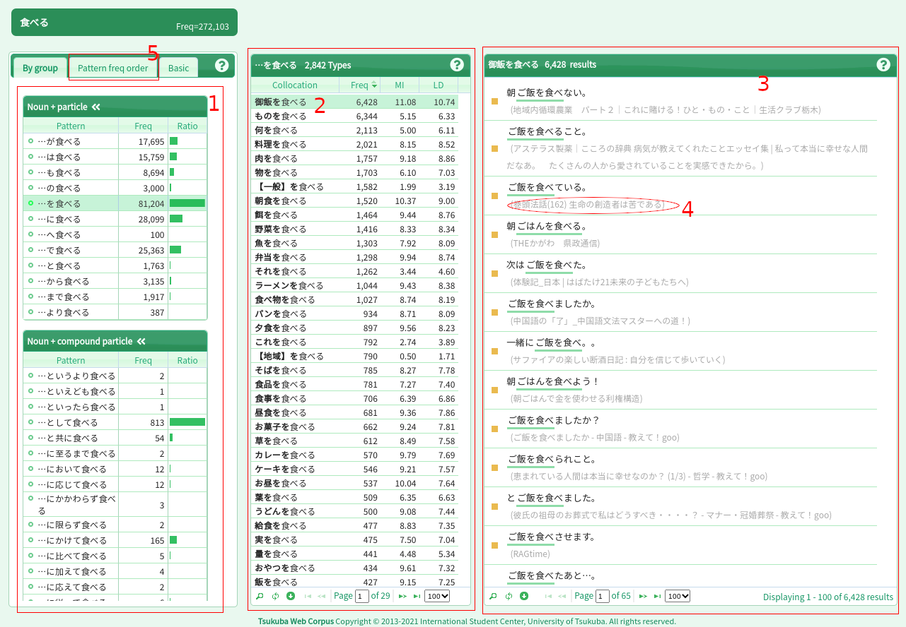

# What words or particles should I use with this verb?

There is a website called [tsukuba web corpus](https://tsukubawebcorpus.jp/)
with a collections of all kinds of words/verbs taken from a bunch of native
resources online.

The website breaks down how often words appear with a given particle,
grammatical structure, [collocation](https://en.wikipedia.org/wiki/Collocation),
etc.

You can check on the site if a certain phrase or sequence of particles for a
given verb is acceptable/common/natural, and see its frequency in standard
Japanese usage.

## How to use the Tsukuba Web Corpus

 * Go to the [tsukuba website](https://tsukubawebcorpus.jp/) (and bookmark it)
 * Set the language to English if you want

   

 * Click on **Start Your Search**

   

 * Type the word you want to look up in the **search bar**

   

   **NOTE**: する verbs count as a different word, for example 利用する (verb)
   is a different word from just 利用 (noun)

 * Click on the result to be brought to the **collocations summary page**

   

### The Collocations Summary Page

As you can see, the page can be quite daunting on a first look, so I made sure
to highlight the important parts that you should be looking at, with a brief
explanation:

 1. On the left side, there is a list of all grammatical patterns the searched
    word appears in. They are grouped/sorted by function (Noun + particle,
    Noun + compound particle, Auxiliary verbs, etc) and the numbers will show
    how many entries and how frequent a certain collocation appears in the
    corpus.
 2. After clicking on an entry in **1**, in the middle, there is a list of the
    relevant collocations of the searched word with the given pattern. For
    example if you searched for を particle + `<verb>`, it will show what kind of
    nouns will appear with を (e.g. 食べる -> 肉を食べる)
 3. Click on an entry in **2** and the right side area will show a list of all
    the phrases with the *actual* usage of the word/pattern. It will also show
    the verb in its conjugated forms (食べる -> 食べない, etc)
 4. If you require **context** related to where the sample sentence came from,
    you can click on the area marked as **4** and it will bring up the source
    material
 5. If you click on the "Pattern freq order" tab, the left-most part will
    instead list all grammatical patterns for the searched word ordered by most
    to least amount of occurrences. It's very useful if you want to quickly get
    a general idea.
